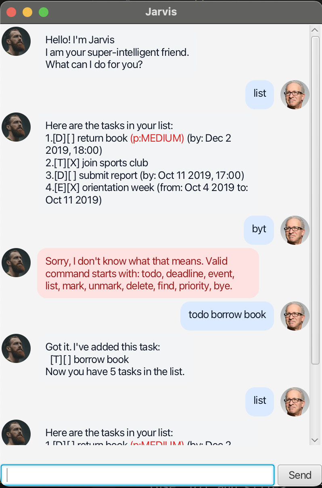

# Jarvis User Guide

Jarvis is a personal intelligent chatbot that helps you manage tasks, by supporting operations such as **todos**, **deadlines**,
**events**, **finding**, and **priorities**. It automatically saves your tasks
to disk and loads them the next time you start the chat again.



## Quick start

### Run Jarvis

If you are using the GUI:

```bash
./gradlew run
```

If you are using the text UI (terminal):

- Run `src/main/java/jarvis/Jarvis.java` from your IDE, then type commands into
  standard input.

To exit:

```text
bye
```

### Data file

- Default data file path (relative to project root): `data/Jarvis.txt`
- Jarvis saves automatically whenever your task list changes
  (add/mark/unmark/delete/priority).
- If the data file exists but is corrupted, Jarvis backs it up as
  `data/Jarvis.txt.corrupted*` and starts with an empty list.

## Features

Notes:

- `taskNumber` is **1-based** (the first task is `1`).
- For commands that take a `taskNumber` (e.g., `mark`, `delete`), use the exact
  format shown. Extra arguments are treated as a format error.

### List tasks: `list`

Shows all saved tasks.

Format:
```text
list
```

### Add a todo: `todo`

Adds a task with only a description.

Format:
```text
todo <description>
```

Example:
```text
todo borrow book
```

### Add a deadline: `deadline`

Adds a task with a due date/time.

Format:
```text
deadline <description> /by <date> [time]
```

Example:
```text
deadline return book /by 2019-12-02 1800
```

### Add an event: `event`

Adds a task with a start and end date/time.

Format:
```text
event <description> /from <date> [time] /to <date> [time]
```

Example:
```text
event project meeting /from 2019-12-02 1400 /to 2019-12-02 1600
```

Constraints:

- Event start must be **earlier** than event end.

### Mark a task as done: `mark`

Format:
```text
mark <taskNumber>
```

Example:
```text
mark 2
```

### Mark a task as not done: `unmark`

Format:
```text
unmark <taskNumber>
```

Example:
```text
unmark 2
```

### Delete a task: `delete`

Removes a task from the list.

Format:
```text
delete <taskNumber>
```

Example:
```text
delete 3
```

### Find tasks: `find`

Lists tasks whose descriptions contain the keyword (case-insensitive).

Format:
```text
find <keyword>
```

Example:
```text
find book
```

### Update priority: `priority`

Sets the priority of a task.

Format:
```text
priority <taskNumber> <low|medium|high|none>
```

Example:
```text
priority 2 high
```

Notes:

- Tasks show priority as a suffix e.g., `(p:HIGH)`, highligted in **red**.
- Use `none` to clear a previously set priority.

## Date and time formats

Dates:

- `yyyy-mm-dd` (e.g., `2019-12-02`)
- `d/M/yyyy` (e.g., `2/12/2019`)

Times (optional):

- `HHmm` (e.g., `1800`)
- `HH:mm` (e.g., `18:00`)

Examples:

- `deadline return book /by 2019-12-02`
- `deadline return book /by 2019-12-02 1800`
- `event meeting /from 2/12/2019 14:00 /to 2/12/2019 16:00`

## Error handling (examples)

If you enter an invalid command format, Jarvis chatbot prints an error
message as follows. The error message box will be colored in **red**.

### Unknown command

Example:
```text
blah
```

### Invalid task number

Example:
```text
mark -1
```

### Invalid deadline format

Example:
```text
deadline return book /by 2019-12-02 /by 2019-12-03
```

## Command summary

| Action | Format / Examples |
| --- | --- |
| List tasks | `list` |
| Add todo | `todo <description>`<br>e.g., `todo borrow book` |
| Add deadline | `deadline <description> /by <date> [time]`<br>e.g., `deadline return book /by 2019-12-02 1800` |
| Add event | `event <description> /from <date> [time] /to <date> [time]`<br>e.g., `event project meeting /from 2019-12-02 1400 /to 2019-12-02 1600` |
| Mark done | `mark <taskNumber>`<br>e.g., `mark 2` |
| Mark not done | `unmark <taskNumber>`<br>e.g., `unmark 2` |
| Delete task | `delete <taskNumber>`<br>e.g., `delete 3` |
| Find tasks | `find <keyword>`<br>e.g., `find book` |
| Update priority | `priority <taskNumber> <low\|medium\|high\|none>`<br>e.g., `priority 2 high` |
| Exit | `bye` |

## Project structure

```text
src/
├─ main/
│  ├─ java/
│  │  └─ jarvis/
│  │     ├─ Launcher.java        # GUI entry point (JavaFX)
│  │     ├─ Main.java            # JavaFX application setup
│  │     ├─ JarvisGui.java        # GUI command handling
│  │     ├─ Jarvis.java           # Text UI entry point
│  │     ├─ Parser.java          # Command parsing
│  │     ├─ Storage.java         # File I/O operations
│  │     ├─ TaskList.java        # Task list management
│  │     ├─ Task.java            # Base task type
│  │     ├─ Todo.java            # Todo task
│  │     ├─ Deadline.java        # Deadline task
│  │     ├─ Event.java           # Event task
│  │     ├─ Priority.java        # Priority levels
│  │     ├─ DateTimeParser.java  # Date/time parsing and formatting
│  │     ├─ Ui.java              # Text UI printing
│  │     └─ ui/                  # JavaFX UI components
│  │        ├─ MainWindow.java   # Main window controller
│  │        └─ DialogBox.java    # Chat dialog component
│  └─ resources/
│     ├─ images/                 # UI images
│     └─ view/                   # FXML layouts + CSS
│        ├─ MainWindow.fxml
│        ├─ DialogBox.fxml
│        └─ styles.css
└─ test/
   └─ java/
      └─ jarvis/                  # JUnit tests
```

## Acknowledgements

This project was developed as part of the CS2103 Software Engineering module at
NUS.


